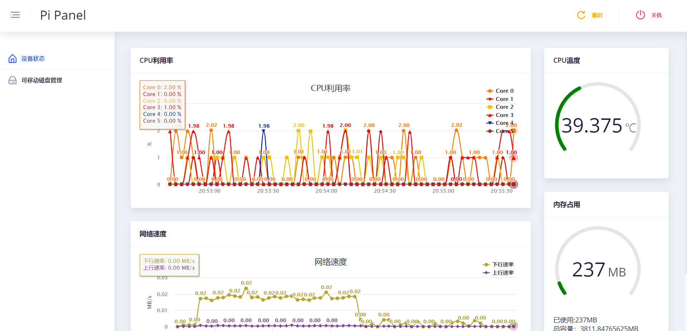

# pi-panel

pi-panel是运行在单板电脑（如Raspberry Pi等）Linux系统的控制面板。支持的运行环境为Armbian，其他发行版的兼容性暂未测试。


## 使用方法
使用`-b`选项指定IP和端口。`-m`选项指定可移动磁盘挂载点的根路径；此选项可省略不设置，则默认设置为`\mnt`。示例如下
```shell
chmod +x pi-panel
./pi-panel -b 192.168.1.2:8080
```

